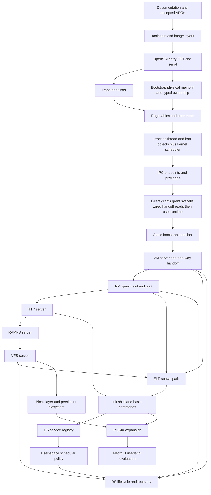

# Development Dependency DAG

## Why this graph exists

The stable runtime architecture of a microkernel system is cyclic. For
example, process creation may involve PM, VFS, and VM; service recovery may
involve nearly every core server. A cyclic runtime graph cannot be used as an
implementation order.

This document defines a separate development graph. Each edge means that the
predecessor must have a tested, stable interface before work starts on the
successor. Bootstrap substitutions intentionally break the runtime cycles.

## Graph

The graph deliberately serializes the first implementation even where some
engineering work could be performed independently. This keeps reviews and
failures attributable to one coherent change.

## Cycle-breaking substitutions

| MINIX runtime cycle | Initial `micros` substitution | Later transition |
| --- | --- | --- |
| Kernel and VM depend on each other | Kernel bootstrap allocator, typed ownership ledger, and static mappings | One-way VM ownership handoff |
| RS coordinates VM, PM, scheduler, and services | Static manifest plus bootstrap launcher | RS adopts the stable service protocol |
| PM, VFS, and VM coordinate fork/exec | PM-directed `spawn` transaction | Add `exec`, then `fork` and copy-on-write |
| VFS, filesystem servers, drivers, and DS discover each other | Fixed RAMFS endpoint and static mount | DS publication and dynamic drivers |
| Kernel scheduler mechanism calls user scheduling policy | Kernel round-robin policy | User scheduler receives policy events |
| File-backed VM calls VFS while VFS calls VM | Resident anonymous memory and RAMFS executable reads | Explicit asynchronous file-backed mapping protocol |

## Topological implementation sequence

| Step | Deliverable | Required proof before the next step |
| --- | --- | --- |
| 1 | Documentation and ADR package | Decisions reviewed; DAG and scope internally consistent |
| 2 | Toolchain, linker layout, QEMU launch | Reproducible ELF build and deterministic QEMU exit |
| 3 | OpenSBI entry, FDT, UART, panic | Memory and reservations parsed; boot marker and panic diagnostics visible |
| 4 | Traps, timer, bootstrap allocator, typed frame ownership | Expected exception recovery, timer ticks, allocator/owner invariants, and atomic handoff classification |
| 5 | Page tables, process/thread/hart objects, user mode | U-mode isolation and repeated thread context switches |
| 6 | Scheduler, endpoints, IPC | Blocking, wakeup, reply-token, stale endpoint, privilege, and deadlock tests |
| 7 | Grants, grant syscalls, wired handoff reads, then user runtime | First prove real U-mode grant lifecycle and copies before and after handoff for wired service pages; then prove one standalone freestanding ELF, startup path, raw `ecall`, and C wrappers for operations 1 through 10 |
| 8 | Bootstrap launcher | Immutable manifest validation, deterministic topology, held-image preparation, exact profile/publication release, token-bound readiness, internal timeout failure, and irreversible authority revocation verified |
| 9 | VM handoff | Frame ownership is disjoint and the VM working set remains wired |
| 10 | PM | PM identity, hidden process reservation, spawn metadata, exit, wait, and failure rollback verified |
| 11 | TTY | Two-phase console handoff, deferred PLIC completion, input, and output verified |
| 12 | RAMFS | Directory, file, and direct VFS-facing grant protocol tests pass |
| 13 | VFS | Descriptor, console binding, pathname, mount, routing, and complete two-hop I/O verified |
| 14 | Executable path, init, shell | Instruction synchronization passes and the shell runs the required commands |
| 15 | DS, scheduler server, RS | Discovery and injected service recovery verified |
| 16+ | Persistent storage and POSIX work | Added only behind explicit ADRs and conformance tests |

Step 7 is internally serialized even though it is one graph node:

1. endpoint and IPC mechanisms;
2. direct-grant identity and lifetime;
3. checked copies;
4. wired post-handoff address-space reads;
5. the unified operations 1 through 10;
6. the freestanding user-service runtime.

The runtime is not complete merely because the kernel ABI is callable from a
test payload. It requires an independent user ELF, loader/BSS/stack contract,
ABI-preserving raw stub, typed C wrappers, and target acceptance. The static
launcher remains blocked until that complete runtime outcome is reviewed and
implemented.

Step 8 is also internally serialized:

1. validate the pointer-free manifest, immutable profile identities, generated
   image catalog, resource bounds, explicit prerequisites, and cycle-free
   lowest-ID topological order;
2. prepare every static process, root, image, stack, first thread, context,
   reserved endpoint, and held scheduling policy before launcher entry;
3. run only the launcher with its exact profile and active endpoint;
4. atomically install one service's exact profile, publish its endpoint, arm
   one guest-owned readiness deadline, and release its prepared thread;
5. accept one exact-generation readiness call and acknowledge it through the
   request's one-shot reply token;
6. repeat only after the previous service is ready; and
7. hold the launcher, clear the exact controller binding, and irreversibly
   seal bootstrap authority; its retained endpoint and profile remain inert
   until later teardown.

The initial static service chain is launcher, VM, PM, TTY, RAMFS, and VFS.
The Step 8 implementation uses test-only probe ELFs and does not implement
those service protocols. VM readiness is extended at Step 9 so the generic
ready call follows the ownership commit. TTY readiness is extended at Step 11
so release follows `console_handoff_begin` and readiness follows
`console_handoff_commit`.

Step 9 is internally serialized:

1. define and validate the fixed pointer-free VM boot-information/frame-state
   object;
2. atomically stage every static `PROCESS_USER` frame as `VM_WIRED`;
3. patch and read back the exact VM object before launcher publication;
4. start the real VM service and independently validate its frame database;
5. accept one exact VM-only scalar summary operation;
6. commit the irreversible ownership phase;
7. return to VM through post-handoff wired authority;
8. accept VM's ordinary launcher readiness only after that commit; and
9. prove the launcher can seal while VM remains wired.

Step 9 does not add dynamic mapping or non-VM page-fault delivery. Those
interfaces require a later reviewed mapping authority before PM or executable
loading may consume them.

Step 10 is internally serialized:

1. define the PM application table, semantic PID, parent/child, init-reaper,
   exit, zombie, and wait contracts;
2. add the exact PM bootstrap role and profile, the stable inert
   `APPLICATION` profile identity, and PM readiness;
3. inject one kernel-origin event when launcher authority is irreversibly
   sealed;
4. reserve and abort one hidden empty kernel process through exact PM-only
   authority;
5. prove the complete future spawn transaction and reverse rollback order in a
   native transition model;
6. prove versioned exit/wait decoding and malformed-client rejection; and
7. run one real PM service after VM handoff without creating a dynamic child.

The Step 10 reservation has no root, thread, endpoint, profile, mapping,
grant, scheduler state, or process-owned frame. It preserves the process slot
needed by a later transaction but cannot be published or run.

Step 10 does not add a successful spawn path, dynamic mapping, executable
loading, descriptor state, or running-process target teardown. Step 14 adds
those integrations only after VM, PM, TTY, RAMFS, and VFS are all
dependency-ready. At that point, VM creates and freezes mappings for the
reserved process; PM's prepare transition creates the first thread and
reserved endpoint, installs `APPLICATION`, attaches the executable context,
and seals the mapping generation before final activation.

Step 11 is internally serialized:

1. fix the local MINIX TTY, grant, buffering, MMIO, notification, and explicit
   IRQ-acknowledgment baseline;
2. prepare one exact launcher/VM/TTY console binding and keep UART source 10
   disabled;
3. begin handoff, arm one manifest-bounded deadline, disable ordinary kernel
   output, and notify VM while TTY remains held;
4. let exact VM authority install only the fixed UART leaf at `0x7fffe000`
   without allocation or page-table growth;
5. notify the launcher from the kernel after that PTE commits, then release
   TTY;
6. initialize the NS16550A, drain stale state, commit ownership, install the
   PLIC route, and only then accept TTY readiness;
7. claim source 10, notify exact TTY, retain it in service, and complete it
   only after TTY drains the device;
8. prove bounded canonical input, interrupt-driven output, exact grants,
   cancellation, completion and writable notifications, lost-wakeup
   prevention, and malformed-request rejection in native models; and
9. run one real QEMU TTY scenario with deterministic host input and no sleeps.

Step 11's post-handoff mapping is a one-shot device exception. It does not add
ordinary frames, map/unmap selection, page-table growth, page faults, scratch
aliases, or the Step 14 executable-mapping transaction.

Step 12 is internally serialized:

1. fix the local MINIX VFS, libfsdriver, MFS mount, lookup, create, mkdir,
   read/write, getdents, and putnode baseline;
2. define one reproducible pointer-free seed image and fixed BSS node, block,
   path, name, file, transfer, and directory-record bounds;
3. add generation-safe node identity, exact link/reference ownership, root
   confinement, sparse-file semantics, and failure-atomic mutation in native
   tests;
4. define and model exact VFS-only mount, lookup, create, mkdir, read, write,
   getdents, and putnode calls with directional one-page grants;
5. run one replayable mixed RAMFS model that compares complete production and
   independent reference state after every operation;
6. add the exact RAMFS/VFS profile relationships, real RAMFS seed
   initialization, readiness, and single-threaded service loop;
7. run one six-service QEMU scenario with the real launcher, VM, PM, TTY, and
   RAMFS plus an exact test VFS peer; and
8. prove seed validation, one mount, path lookup, writable sparse data,
   complete-record cursors, balanced references, checked grants, and clean
   launcher sealing.

Step 12 does not add production VFS descriptors, application I/O, unlink,
rename, truncate, block storage, executable loading, init, or shell behavior.
Those remain at their later DAG nodes.

Step 13 is internally serialized:

1. fix the local MINIX VFS caller, process, descriptor, open-file, vnode,
   pathname, character-device, directory-record, and exit-cleanup baseline;
2. add one non-copying grantee-only grant-range preflight so a consuming
   second hop cannot lose terminal input on an invalid application
   destination, and atomically move manifest storage, service configuration,
   and VM boot information to their exact capacity-seven layouts;
3. define fixed process, descriptor, open-file, vnode, root/cwd, bounce-page,
   directory-record, and asynchronous-operation bounds;
4. implement and model exact application open, close, read, write, getdents,
   mkdir, and chdir calls;
5. mount RAMFS once, aggregate backend references, and bind trusted process
   descriptors 0, 1, and 2 to one synthetic console object;
6. compose TTY submit, completion, collection, cancellation, and writable
   retry without blocking VFS's receive loop;
7. run one replayable mixed VFS model that compares complete production and
   independent reference state after every operation; and
8. run one seven-process QEMU scenario with the six real production services
   plus an isolated application probe that proves both grant hops, pathname
   routing, translated directories, console I/O, zero live grants, and clean
   launcher sealing.

The bootstrap object may store seven entries for that isolated fixture, but
the production manifest remains exactly the six-service chain. The probe is
not `init`, cannot call RAMFS or TTY, and does not implement production spawn.

Step 13 does not add PM/VFS transaction messages, executable buffering,
dynamic mapping, application activation, target exit teardown, seek, truncate,
unlink, rename, named devices, pipes, sockets, block devices, signals, init, or
the shell. Step 14 adds those dependency-ready integrations around the
reviewed VFS state owner.

`init` is not a static manifest service. Step 14 creates it through the
ADR-0009 PM/VFS/VM spawn transaction after launcher authority is sealed.

## Phase gates

### Mechanism gate

Before the first user server, the kernel must demonstrate:

- user/supervisor memory isolation;
- preemption;
- distinct process, thread, endpoint, and hart objects;
- repeatable context switching;
- generation-aware endpoint rejection;
- exact reply-token matching to a blocked thread;
- IPC permission enforcement;
- finite deadlock-chain detection;
- bounded direct grants.

### Runtime gate

Before the static launcher, the user runtime must demonstrate:

- one standalone fixed-address ELF with exact RX, R, and RW/NX closure;
- loader-owned BSS zeroing and an external aligned writable stack;
- a C-ABI-preserving raw `ecall` boundary;
- typed wrappers for every stable operation 1 through 10;
- exact stable results without `errno`;
- no relocation, hosted libc, heap, TLS, constructors, arguments, or service
  readiness policy.

### Service gate

Before executable loading, VM, PM, TTY, RAMFS, and VFS must each:

- start from the static launcher;
- perform one exact-generation, versioned readiness call and receive its
  token-bound acknowledgment;
- reject malformed requests;
- survive ordinary client termination without leaking owned state;
- expose enough diagnostics to identify the current request and peer endpoint.

### Shell MVP gate

The first MVP is complete when a clean build boots under QEMU and an automated
serial session can:

1. observe the init and shell readiness markers;
2. run `echo`;
3. read a seeded RAMFS file with `cat`;
4. list a directory with `ls`;
5. list processes with `ps`;
6. terminate a child and collect it through `wait`;
7. shut down QEMU with a successful test result.

## Rules for changing the graph

- A new predecessor requires an ADR or a documented correction to an existing
  dependency.
- A runtime cycle must not be introduced into the development graph.
- Work on a successor does not begin while its predecessor pull request is
  awaiting review.
- Deferred components cannot be pulled into the shell MVP merely to emulate
  MINIX more closely.
