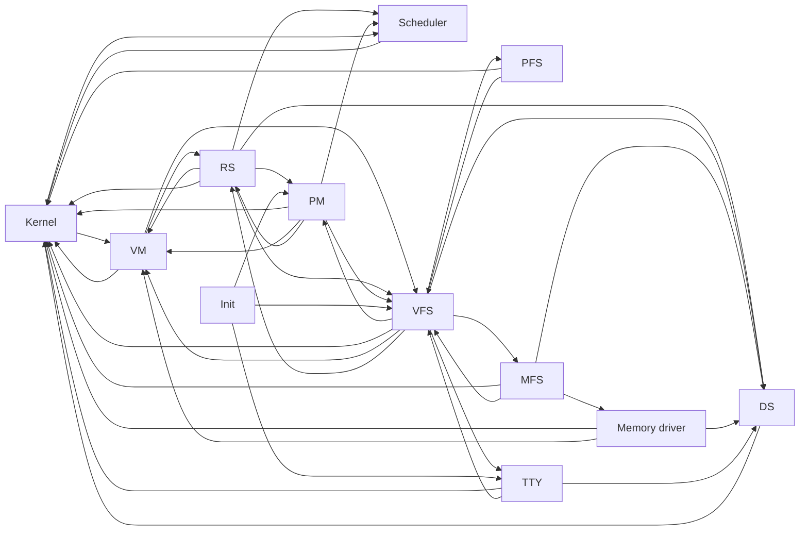

# MINIX Dependency Analysis

## Objective

The goal of this analysis is not to reproduce the MINIX build order. It is to
identify the architectural dependencies that matter when constructing a
smaller system from scratch, find the cycles in the stable runtime, and derive
explicit bootstrap substitutions for `micros`.

## Source baseline

- Repository: MINIX 3 source tree.
- Commit: `4db99f4012570a577414fe2a43697b2f239b699e`.
- Commit date: 2018-11-14.
- Analysis scope: kernel, VM, RS, PM, scheduler, VFS, DS, PFS, MFS, memory
  driver, TTY driver, IPC, endpoints, grants, and their support libraries.

Paths and line ranges below refer to that commit.

## Method

Dependencies were classified into three graphs:

1. **Build dependencies** describe which objects and libraries are needed to
   produce an image.
2. **Boot dependencies** describe which components must exist or be privileged
   before another component can become runnable.
3. **Runtime dependencies** describe IPC, kernel-call, discovery, and data-flow
   relationships after the system is stable.

Only the runtime graph exposes the major architectural cycles. Strongly
connected component analysis was therefore applied to runtime availability
dependencies, not merely include files or linker inputs.

## Approximate physical source size

These counts include comments, blank lines, headers, and architecture-specific
code. They are useful only for relative scope.

| Area | Physical lines |
| --- | ---: |
| `minix/kernel` | 27,358 |
| `minix/servers/vm` | 11,565 |
| `minix/servers/pm` | 4,747 |
| `minix/servers/sched` | 658 |
| `minix/servers/vfs` | 17,742 |
| `minix/servers/rs` | 6,808 |
| `minix/servers/ds` | 902 |
| `minix/fs/pfs` | 451 |
| `minix/fs/mfs` | 4,096 |
| `minix/drivers/storage/memory` | 608 |
| `minix/drivers/tty/tty` | 5,503 |
| `minix/lib/libsys` | 9,218 |
| `minix/lib/libfsdriver` | 1,771 |
| `minix/lib/libbdev` | 1,431 |

Large bundled networking, ACPI, legacy command, and broad driver trees were
excluded from the proposed `micros` MVP.

## Boot model

MINIX does not start each server only after all of its stable dependencies are
already running. The kernel image contains a predefined boot process table.
During early initialization, kernel tasks, RS, and VM receive special treatment
while most other boot processes remain inhibited.

Relevant evidence:

| Source | Evidence |
| --- | --- |
| `minix/kernel/table.c:44-64` | Declares the boot image containing RS, PM, VFS, VM, MFS, init, and other processes |
| `minix/kernel/main.c:196-266` | Initializes boot processes and initially permits only privileged bootstrap participants to run |
| `minix/servers/rs/table.c` | Defines boot service order, privileges, devices, and service metadata |
| `minix/servers/rs/main.c:350-426` | Releases services and waits for SEF initialization readiness |
| `minix/servers/rs/manager.c` | Coordinates service creation, privileges, VM setup, scheduling, and restart |

The result is a staged transition into the stable runtime graph, not a simple
topological boot of that graph.

## Runtime dependency graph

The central runtime relationships used by the SCC calculation are summarized
below. An edge points from a component to another component on which it can
synchronously block or which it requires for stable operation. This includes
kernel IPC/call dependencies and the reverse side of synchronous service
protocols, not only initial request direction.



This diagram still omits request types inside each protocol, but it contains
the component edges used by the stated SCC result.

## Strongly connected component result

When runtime availability is treated as a dependency, the following core
components collapse into one major strongly connected component:

```text
kernel
vm
rs
pm
sched
vfs
ds
pfs
mfs
memory
tty
```

`init` remains outside that component because it consumes stable services
without being required to construct them.

This result explains why "implement MINIX components in topological order" is
not directly possible. The graph becomes useful only after each bootstrap
cycle is replaced with a temporary mechanism and the component graph is
condensed into a development DAG.

## Evidence for major cycles

### Kernel and VM

- `minix/kernel/proc.c:234-281` can suspend kernel work and request VM
  assistance when message copying or a kernel call encounters a memory fault.
- `minix/servers/vm/main.c:428-558` initializes VM state, maps boot services,
  and registers privileged calls.
- VM uses kernel calls to manipulate page tables and process memory.

MINIX therefore reaches stability through privileged bootstrap mappings and a
special VM startup path.

### PM and VFS

- `minix/servers/pm/main.c:226-235` sends boot process metadata to VFS and
  waits for synchronization.
- `minix/servers/pm/forkexit.c:78-130` coordinates fork state with VM and VFS.
- VFS tracks filesystem-side process state required by fork, exec, and exit.

Neither server independently owns the complete POSIX process model.

### VM and VFS

- `minix/servers/vm/vfs.c:51-89` constructs asynchronous VM-to-VFS requests for
  file-backed memory work.
- `minix/servers/vfs/misc.c:383-493` handles those requests and replies to VM.
- VFS also requires VM operations while servicing process and executable work.

This is a stable asynchronous protocol, but it is unsuitable as an initial
bootstrap dependency.

### VFS, filesystem servers, drivers, and DS

- `minix/servers/vfs/main.c:416-516` synchronizes process metadata, subscribes
  to DS events, and mounts PFS and the MFS root.
- `minix/lib/libfsdriver/fsdriver.c` dispatches the VFS/filesystem protocol.
- `minix/lib/libbdev` performs filesystem-to-block-driver IPC and discovery.
- `minix/drivers/storage/memory/memory.c` supplies boot RAM disk and memory
  devices.

The persistent root path therefore relies on several services that are not
needed for a volatile educational MVP.

### Kernel and user scheduler

- `minix/kernel/proc.c:1875-1888` notifies a user-space scheduler when a process
  exhausts its quantum.
- The scheduler returns policy decisions through privileged kernel calls.

The kernel still provides the scheduling mechanism and a bootstrap policy
before the external scheduler is available.

## IPC observations

The analyzed MINIX ABI provides several useful design lessons:

- messages are fixed at 64 bytes;
- endpoints contain a process slot and generation, preventing stale identity
  reuse;
- kernel masks restrict permitted IPC targets and privileged calls;
- blocking IPC includes send-chain deadlock detection;
- notifications provide coalesced event delivery;
- bulk data uses direct, indirect, and magic grants plus safe-copy operations.

`micros` retains the fixed message, generation-aware endpoint, permission,
deadlock, notification, and safe-copy concepts. It intentionally begins with
kernel-managed direct grants only.

## Derived `micros` transformations

| Observation | `micros` decision |
| --- | --- |
| Kernel and VM require a privileged startup path | Use a kernel bootstrap allocator, then a one-way VM handoff |
| RS participates in almost every startup edge | Use a static launcher before implementing recovery |
| PM/VFS/VM process semantics are cyclic | Implement a PM-directed spawn transaction before fork |
| Persistent root startup requires VFS, FS, block driver, and DS | Start with RAMFS and a fixed endpoint |
| User scheduling policy depends on kernel scheduling events | Keep round-robin policy in the kernel initially |
| File-backed memory creates VM/VFS callbacks | Require resident anonymous buffers in the first data path |
| Full grant machinery is broad | Implement direct grants only |

## Limitations

- This is a component-level architecture analysis, not a complete call graph.
- Physical line counts do not represent logical complexity or executable size.
- Optional MINIX configurations may add or remove edges.
- The derived DAG is optimized for `micros` learning value and MVP scope, not
  for reproducing MINIX behavior exactly.
